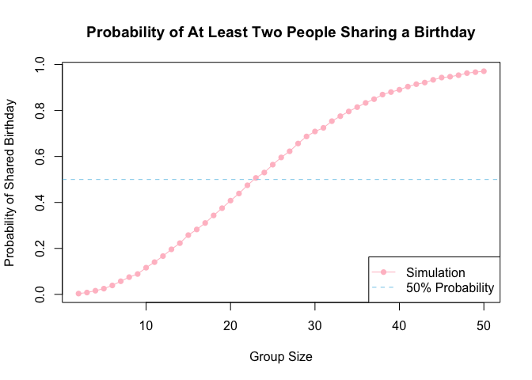
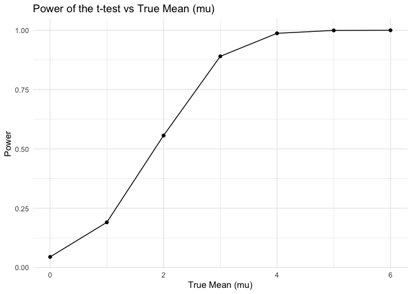
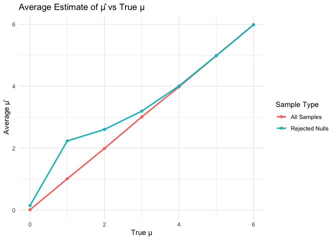
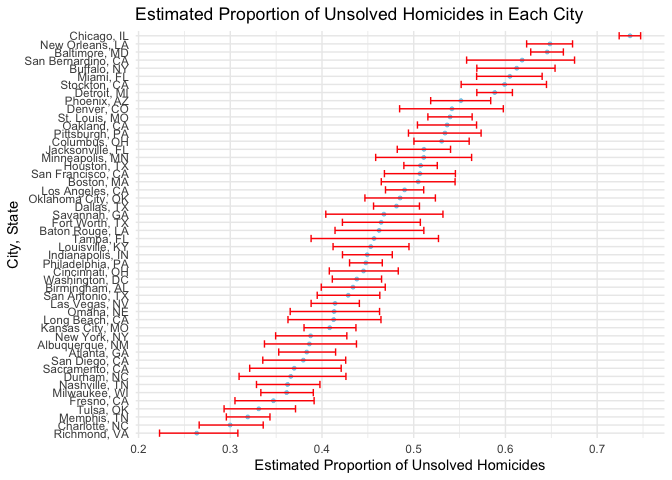

p8105_hw5_yc4588
================
Yining Cao
2024-11-10

- [Problem 1：Birthday Simulation](#problem-1birthday-simulation)
- [Problem 2 : Explore power in a one-sample
  t-test](#problem-2--explore-power-in-a-one-sample-t-test)
- [Problem 3: Analysis of Homicide
  Data](#problem-3-analysis-of-homicide-data)

### Load necessary packages

## Problem 1：Birthday Simulation

``` r
set.seed(123)

shared_birthday =  function(group_size) {
  birthdays =  sample(1:365, group_size, replace = TRUE)
  return(length(unique(birthdays)) < group_size)
}

# Run simulations and compute probabilities
birthday_simulation <- function(runs = 10000, max_group_size = 50) {
  probabilities =  numeric(max_group_size - 1)
  
  for (group_size in 2:max_group_size) {
    results =  replicate(runs, shared_birthday(group_size))
    probabilities[group_size - 1] =  mean(results)
  }
  
  return(probabilities)
}

probabilities =  birthday_simulation()

group_sizes = 2:50
plot(group_sizes, probabilities, type = "o", col = "pink", pch = 16, 
     main = "Probability of At Least Two People Sharing a Birthday",
     xlab = "Group Size", ylab = "Probability of Shared Birthday")
abline(h = 0.5, col = "skyblue", lty = 2)
legend("bottomright", legend = c("Simulation", "50% Probability"), 
       col = c("pink", "skyblue"), lty = c(1, 2), pch = c(16, NA))
```

<!-- -->

- The function and figure illustrate the probability that at least two
  people in a room share a birthday, with the number of people ranging
  from 2 to 50. As the number of individuals in the room increases, the
  likelihood of a shared birthday gradually rises. By the time there are
  50 people, the probability approaches 100%.

## Problem 2 : Explore power in a one-sample t-test

### Conduct a simulation to explore power in a one-sample t-test

``` r
set.seed(123)

power_function = function(mu) {
  n = 30
  sigma = 5
  sample_data = rnorm(n, mean = mu, sd = sigma)
  test_result = t.test(sample_data, mu = 0) |>
    broom::tidy() |>
    select(estimate, p.value)
    
  return(test_result)
}

mul_mu =
  expand_grid(
  mu = 0:6,
  iter = 1:5000
) |>
  mutate(result = map(mu, power_function)) |>
  unnest(result)

power_results <- mul_mu |>
  group_by(mu) |>
  summarize(power = mean(p.value < 0.05))

ggplot(power_results, aes(x = mu, y = power)) +
  geom_line() +
  geom_point() +
  labs(
    title = "Power of the t-test vs True Mean (mu)",
    x = "True Mean (mu)",
    y = "Power"
  ) +
  theme_minimal()
```

<!-- -->

- The resulting plot illustrates how power increases as the true mean
  (μ) deviates further from 0, showing a stronger ability to detect
  larger effect sizes. When the true mean approaches 5, the power of the
  t-test is nearly 100%, indicating a high probability of correctly
  rejecting the null hypothesis.

### Plot showing that the average estimate of 𝜇̂ vs. the true 𝜇in all samples and in samples where the null hypothesis is rejected

``` r
average_estimates <- mul_mu |>
  group_by(mu) |>
  summarize(
    avg_mu_hat_all = mean(estimate),
    avg_mu_hat_rejected = mean(estimate[p.value < 0.05], na.rm = TRUE)
  )

average_estimates_long <- average_estimates |>
  pivot_longer(
    cols = c(avg_mu_hat_all, avg_mu_hat_rejected),
    names_to = "type",
    values_to = "avg_mu_hat"
  ) |>
  mutate(type = recode(type,
                       "avg_mu_hat_all" = "All Samples",
                       "avg_mu_hat_rejected" = "Rejected Nulls"))

# Create plot with legend
ggplot(average_estimates_long, aes(x = mu, y = avg_mu_hat, color = type)) +
  geom_line(linewidth = 1) +
  geom_point() +
  labs(
    title = "Average Estimate of μ̂ vs True μ",
    x = "True μ",
    y = "Average μ̂",
    color = "Sample Type"
  ) +
  theme_minimal()
```

<!-- -->

- No, they are not approximately equal. When the null hypothesis is
  rejected, the average estimate of μ tends to be higher than the true
  value of μ for smaller values of μ, but it approaches the true μ as μ
  increases. This happens due to selection bias: rejection of the null
  occurs only when the sample mean is unusually high, leading to an
  overestimate of μ in cases where the true μ is small.

## Problem 3: Analysis of Homicide Data

### Import the dataset

``` r
homicide_data = read_csv("homicide-data.csv")
```

    ## Rows: 52179 Columns: 12
    ## ── Column specification ────────────────────────────────────────────────────────
    ## Delimiter: ","
    ## chr (9): uid, victim_last, victim_first, victim_race, victim_age, victim_sex...
    ## dbl (3): reported_date, lat, lon
    ## 
    ## ℹ Use `spec()` to retrieve the full column specification for this data.
    ## ℹ Specify the column types or set `show_col_types = FALSE` to quiet this message.

- The dataset contains 52179 rows and 12 columns.
- Variables in the dataset include: uid, reported_date, victim_last,
  victim_first, victim_race, victim_age, victim_sex, city, state, lat,
  lon, disposition.

### Clean the dataset and create a *city_state* variable

``` r
homicide_data <- homicide_data |>
  mutate(state = replace(state, state == "wI", "WI"),
         city_state = str_c(city, state, sep = ", "),
         resolution = case_when(
           disposition == "Closed without arrest" ~ "unsolved",
           disposition == "Open/No arrest" ~ "unsolved",
           disposition == "Closed by arrest" ~ "solved")) |>
  relocate(city_state, resolution) |> 
  filter(city_state != "Tulsa, AL") 
```

### To obtain the total number of homicides and the number of unsolved homicides

``` r
homicide_df = 
  homicide_data |> 
  group_by(city_state) |> 
  summarize(
    total = n(),
    sum_unsolved = sum(resolution == "unsolved")
  )

knitr::kable(homicide_df)
```

| city_state         | total | sum_unsolved |
|:-------------------|------:|-------------:|
| Albuquerque, NM    |   378 |          146 |
| Atlanta, GA        |   973 |          373 |
| Baltimore, MD      |  2827 |         1825 |
| Baton Rouge, LA    |   424 |          196 |
| Birmingham, AL     |   800 |          347 |
| Boston, MA         |   614 |          310 |
| Buffalo, NY        |   521 |          319 |
| Charlotte, NC      |   687 |          206 |
| Chicago, IL        |  5535 |         4073 |
| Cincinnati, OH     |   694 |          309 |
| Columbus, OH       |  1084 |          575 |
| Dallas, TX         |  1567 |          754 |
| Denver, CO         |   312 |          169 |
| Detroit, MI        |  2519 |         1482 |
| Durham, NC         |   276 |          101 |
| Fort Worth, TX     |   549 |          255 |
| Fresno, CA         |   487 |          169 |
| Houston, TX        |  2942 |         1493 |
| Indianapolis, IN   |  1322 |          594 |
| Jacksonville, FL   |  1168 |          597 |
| Kansas City, MO    |  1190 |          486 |
| Las Vegas, NV      |  1381 |          572 |
| Long Beach, CA     |   378 |          156 |
| Los Angeles, CA    |  2257 |         1106 |
| Louisville, KY     |   576 |          261 |
| Memphis, TN        |  1514 |          483 |
| Miami, FL          |   744 |          450 |
| Milwaukee, WI      |  1115 |          403 |
| Minneapolis, MN    |   366 |          187 |
| Nashville, TN      |   767 |          278 |
| New Orleans, LA    |  1434 |          930 |
| New York, NY       |   627 |          243 |
| Oakland, CA        |   947 |          508 |
| Oklahoma City, OK  |   672 |          326 |
| Omaha, NE          |   409 |          169 |
| Philadelphia, PA   |  3037 |         1360 |
| Phoenix, AZ        |   914 |          504 |
| Pittsburgh, PA     |   631 |          337 |
| Richmond, VA       |   429 |          113 |
| Sacramento, CA     |   376 |          139 |
| San Antonio, TX    |   833 |          357 |
| San Bernardino, CA |   275 |          170 |
| San Diego, CA      |   461 |          175 |
| San Francisco, CA  |   663 |          336 |
| Savannah, GA       |   246 |          115 |
| St. Louis, MO      |  1677 |          905 |
| Stockton, CA       |   444 |          266 |
| Tampa, FL          |   208 |           95 |
| Tulsa, OK          |   583 |          193 |
| Washington, DC     |  1345 |          589 |

### Run a prop.test for the city of Balitmore, MD

``` r
prop_test = prop.test(
  homicide_df |> filter(city_state == "Baltimore, MD") |> pull(sum_unsolved), 
  homicide_df |> filter(city_state == "Baltimore, MD") |> pull(total)) |>
  broom::tidy()
prop_test
```

    ## # A tibble: 1 × 8
    ##   estimate statistic  p.value parameter conf.low conf.high method    alternative
    ##      <dbl>     <dbl>    <dbl>     <int>    <dbl>     <dbl> <chr>     <chr>      
    ## 1    0.646      239. 6.46e-54         1    0.628     0.663 1-sample… two.sided

``` r
ep_ci = prop_test |>
  select(estimate, lower_CI = conf.low, upper_CI = conf.high)
knitr::kable(ep_ci, digits = 3)
```

| estimate | lower_CI | upper_CI |
|---------:|---------:|---------:|
|    0.646 |    0.628 |    0.663 |

### To estimate the proportion of homicides that are unsolved in each city

``` r
prop_test_results = homicide_df |>
  mutate(
    prop_tests = map2(sum_unsolved, total, \(x, y) prop.test(x = x, n = y)),
    prop_tests_tidy = map(prop_tests, broom::tidy)) |>
  select(-prop_tests) |> 
  unnest(prop_tests_tidy) |> 
  select(city_state, estimate, conf.low, conf.high) |>
  mutate(city_state = fct_reorder(city_state, estimate))

knitr::kable(prop_test_results, digits = 3)
```

| city_state         | estimate | conf.low | conf.high |
|:-------------------|---------:|---------:|----------:|
| Albuquerque, NM    |    0.386 |    0.337 |     0.438 |
| Atlanta, GA        |    0.383 |    0.353 |     0.415 |
| Baltimore, MD      |    0.646 |    0.628 |     0.663 |
| Baton Rouge, LA    |    0.462 |    0.414 |     0.511 |
| Birmingham, AL     |    0.434 |    0.399 |     0.469 |
| Boston, MA         |    0.505 |    0.465 |     0.545 |
| Buffalo, NY        |    0.612 |    0.569 |     0.654 |
| Charlotte, NC      |    0.300 |    0.266 |     0.336 |
| Chicago, IL        |    0.736 |    0.724 |     0.747 |
| Cincinnati, OH     |    0.445 |    0.408 |     0.483 |
| Columbus, OH       |    0.530 |    0.500 |     0.560 |
| Dallas, TX         |    0.481 |    0.456 |     0.506 |
| Denver, CO         |    0.542 |    0.485 |     0.598 |
| Detroit, MI        |    0.588 |    0.569 |     0.608 |
| Durham, NC         |    0.366 |    0.310 |     0.426 |
| Fort Worth, TX     |    0.464 |    0.422 |     0.507 |
| Fresno, CA         |    0.347 |    0.305 |     0.391 |
| Houston, TX        |    0.507 |    0.489 |     0.526 |
| Indianapolis, IN   |    0.449 |    0.422 |     0.477 |
| Jacksonville, FL   |    0.511 |    0.482 |     0.540 |
| Kansas City, MO    |    0.408 |    0.380 |     0.437 |
| Las Vegas, NV      |    0.414 |    0.388 |     0.441 |
| Long Beach, CA     |    0.413 |    0.363 |     0.464 |
| Los Angeles, CA    |    0.490 |    0.469 |     0.511 |
| Louisville, KY     |    0.453 |    0.412 |     0.495 |
| Memphis, TN        |    0.319 |    0.296 |     0.343 |
| Miami, FL          |    0.605 |    0.569 |     0.640 |
| Milwaukee, WI      |    0.361 |    0.333 |     0.391 |
| Minneapolis, MN    |    0.511 |    0.459 |     0.563 |
| Nashville, TN      |    0.362 |    0.329 |     0.398 |
| New Orleans, LA    |    0.649 |    0.623 |     0.673 |
| New York, NY       |    0.388 |    0.349 |     0.427 |
| Oakland, CA        |    0.536 |    0.504 |     0.569 |
| Oklahoma City, OK  |    0.485 |    0.447 |     0.524 |
| Omaha, NE          |    0.413 |    0.365 |     0.463 |
| Philadelphia, PA   |    0.448 |    0.430 |     0.466 |
| Phoenix, AZ        |    0.551 |    0.518 |     0.584 |
| Pittsburgh, PA     |    0.534 |    0.494 |     0.573 |
| Richmond, VA       |    0.263 |    0.223 |     0.308 |
| Sacramento, CA     |    0.370 |    0.321 |     0.421 |
| San Antonio, TX    |    0.429 |    0.395 |     0.463 |
| San Bernardino, CA |    0.618 |    0.558 |     0.675 |
| San Diego, CA      |    0.380 |    0.335 |     0.426 |
| San Francisco, CA  |    0.507 |    0.468 |     0.545 |
| Savannah, GA       |    0.467 |    0.404 |     0.532 |
| St. Louis, MO      |    0.540 |    0.515 |     0.564 |
| Stockton, CA       |    0.599 |    0.552 |     0.645 |
| Tampa, FL          |    0.457 |    0.388 |     0.527 |
| Tulsa, OK          |    0.331 |    0.293 |     0.371 |
| Washington, DC     |    0.438 |    0.411 |     0.465 |

### Plot showing the estimate (and CI) of the proportion of unsolved homicides in each city

``` r
prop_test_results |> 
  ggplot(aes(x = city_state, y = estimate)) +
  geom_point(color = "skyblue", size = 1) +
  coord_flip() +
  geom_errorbar(aes(ymin = conf.low, ymax = conf.high), color = "red") +
  labs(title = "Estimated Proportion of Unsolved Homicides in Each City",
       x = "City, State",
       y = "Estimated Proportion of Unsolved Homicides") +
  theme_minimal()
```

<!-- -->
